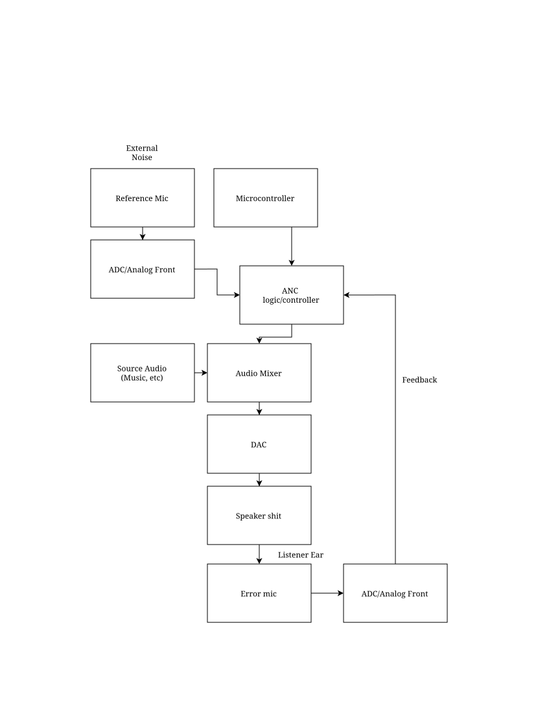

# Anchor Intro/Technical Spec
Note: goal is to be taped-out in tinytapeout, protoype fpga

## Overview
Anchor is an active noise canceling chip that should be integrated into a system shown in the diagram below.
In the current implementation, blocks in orange are defined within this repo, the rest are simulated.

Anchor samples input audio at 16 kHZ and implements [FxLMS filter and a feedforward ANC](https://wiki.analog.com/resources/tools-software/sigmastudio/toolbox/filters/filterednlmsfilter)
to zero out external noise. It also includes an audio mixer that will output the intended audio with the external noise removed.

## Features
These should be completed before adding advanced adaptation features.

| Feature | What belongs in the chip |
|---|---|
| Deterministic FxLMS datapath | Controller FIR, secondary-path FIR, filtered-reference generation, coefficient update, rounding, saturation, and output_valid. |
| Secondary-path coefficient storage and loading | Dedicated S_hat[] memory with load/readback, valid bit, tap count, and signed fixed-point format. |
| Bring-up and operating-mode FSM | Enforce safe sequencing from reset through init, priming, frozen operation, adaptation, calibration, and fault mute. |
| MCU command and MMIO register interface | Address decoding, register permissions, command/status registers, interrupts, coefficient window, readback. |
| MAC initialization/coefficient window | Indirect memory access with memory select, index, auto-increment, active/shadow-bank selection, commit and readback. |
| Deterministic reset, clearing, and priming | Clear histories, accumulators, coefficients, sticky flags, FSMs, and output registers; hold output at zero until ready. |
| Output safety path | Immediate mute, bypass, configurable output limit, saturating conversion, optional output ramp, adaptation freeze on clipping. |
| Fixed-point arithmetic protection | Wider accumulator, deterministic rounding, saturation, overflow detection, coefficient limits and scaling shifts. |
| Clock-domain crossing and buffering | Synchronizers for single-bit controls and async FIFO/handshake logic for sample and command payloads. |
| Sample deadline and overrun enforcement | Sample latch, busy, sample-accepted pulse, output-valid pulse, cycle deadline, overrun and underrun flags. |
| Atomic configuration activation | Shadow registers/banks with a COMMIT command applied only while idle or at a sample boundary. |
| Faults, status and interrupts | Sticky flags for protocol error, invalid config, overrun, deadline miss, clipping, overflow, calibration failure, illegal state. |
| Basic observability and test modes | Read current state, last output, selected coefficient, accumulator snapshot, error power; impulse/constant/PRBS injection and digital loopback. |

If this is unfamilar, a demo/simulation in [`scripts/ans.py`](../../scripts/ans.py) shows the full algorithm at work.

## ANC 
