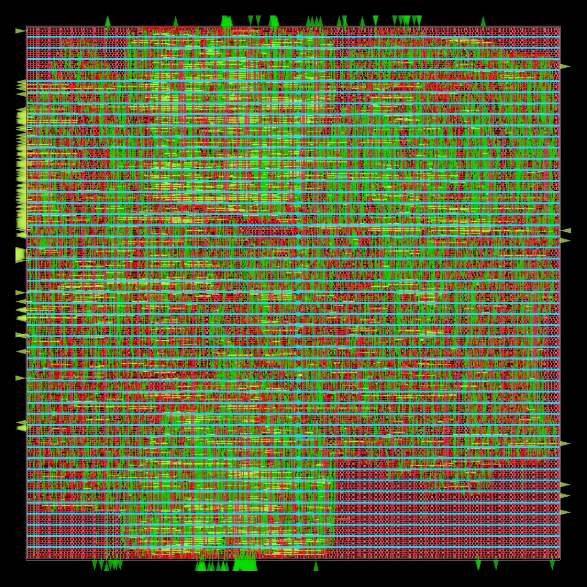

# Noise Canceling Model/Chip design
**about**: active noise canceling chip intended for asic, prototyped on fpga

## Directories
- **scripts**: python scripts to simulate the logic and create golden results for the logic on Chip
  - **audio_sim**: duct/decay/span geometry models feeding the tap budget
  - **out**: generated plots and notes
- **chip**: everything related to chip logic, synthesis and testing
  - **rtl**: systemverilog sources (`pkg/globals.sv`, `sample_in.sv`)
  - **dv**: design verification
    - **golden**: fixed-point reference model of `scripts/ans.py`, layered L0-L4, with the check suite in `demo.py`
  - **doc**: theory of operation, calculations, diagrams
  - **syn**, **physical**, **sw**: placeholders
- **peripherals**: off-chip parts list (adc, etc)
- **main.py**: top-level entry point
